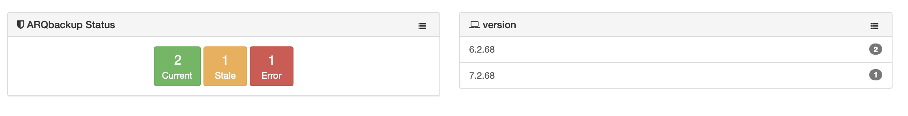

# Arq Backup module

> v. 1.1.0
> January, 2025 
> Alex Narvey / Precursor.ca  

Reports on Arqbackup backup information

Retrieves information from the most recent log file /Library/Logs/ArqAgent/backup.

The following information is stored in the table:

* Version - The Arq.app version
* Source - Name of source (v6 = source volume. v7 = source folder)
* Destination - Name of destination
* Completed - Timestamp of last run
* Amount - Amount in MB, GB or TB (v6 = total backed up. v7 = amount of last backup)
* Error - Error message (the first error message, if any)
* Status = Marked as 'error' if there is an error (for easier search in MR.)

## Notes

An output file is only created if the Arq.app exists in the /Applications folder.
The output file is removed if the Arq.app no longer exists so that new records will not be created.

## Current
Current refers to backups run within the last 24 hours

## Stale
Stale refers to backups more than 24 hours old

## Errors
Errors is independent of whether the backup is fresh or stale.

## Updates

* January 13, 2025 Version 1.1.0  Added a field for 'stored' = total of stored data after cleanup.
* June 26, 2022 Version 1.0.9  Corrections to script. Capitalization of lables and proper spelling of 'Arq Backup' instead of 'ARQbackup'.
* October 22, 2021 Version 1.0.8  Support for new log format of complete, and more efficient script exit when not needed.
* March 4, 2021 Version 1.0.7  Support for Arq 7. Source now reports source folder instead of volume. Amount now reports last backup amount.
* January 16, 2021 Version 1.0.6  Improvements to calculations - extra square brackets for if statements and MB now to 1 decimal point.
* January 8, 2021 Version 1.0.5  Improve calculation of Amount for TB in 3 decimals, and GB and MB to 2 decimal points.
* January 6, 2021 Version 1.0.4  Fix for proper display of "tardy" or stale reports.
* December 29, 2020 Version 1.0.3  Listing view now shows TimeStamp as a readable date.
* December 28, 2020 Version 1.0.2  Script can now handle spaces in Source name and amounts less than 1 GB.
* December 21, 2020 Version 1.0.1  Made changes and modifications for efficienty suggested by John Eberle (Tuxudo)
* December 21, 2020 Version 1.0 

## Contributors
* Alex Narvey

—
Alex Narvey
precursor.ca
